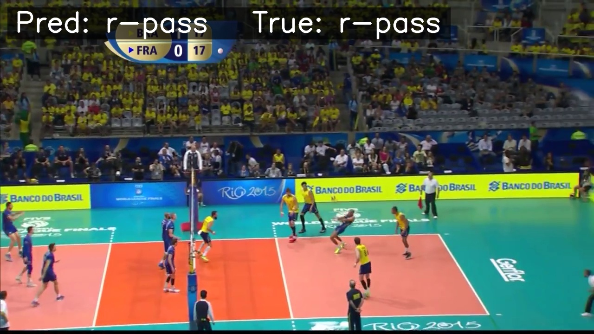
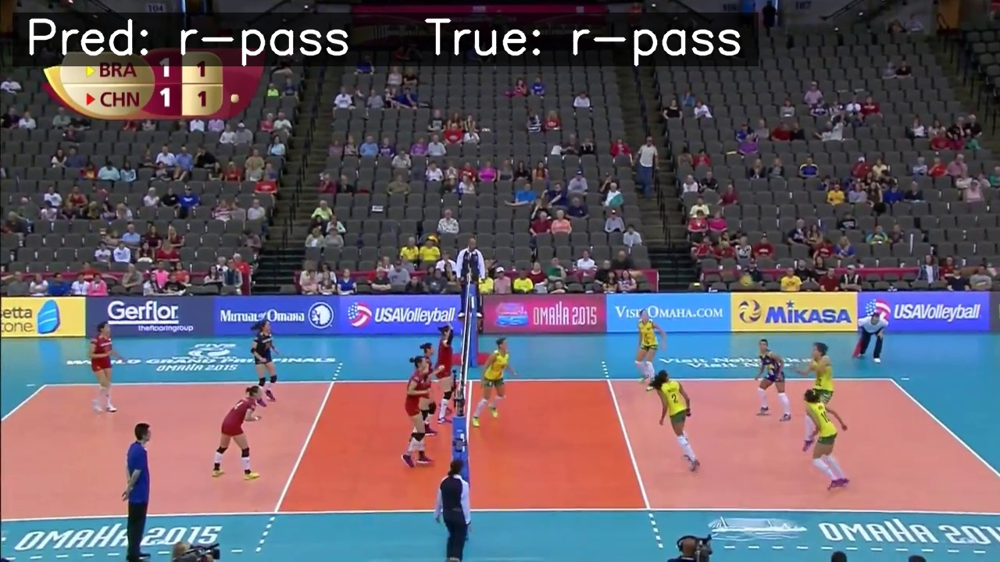
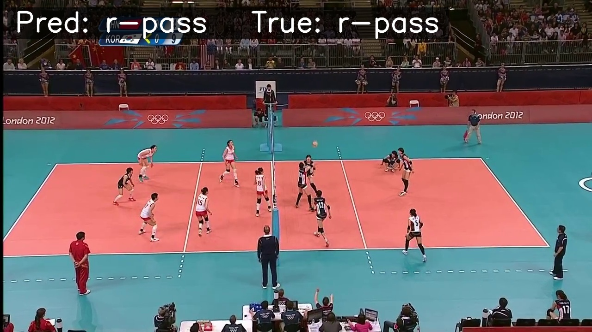
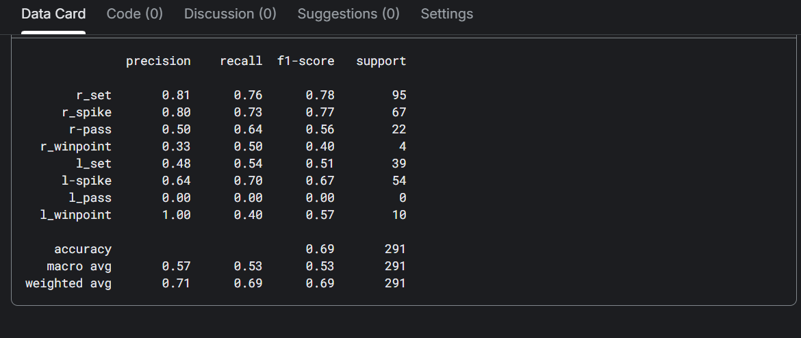
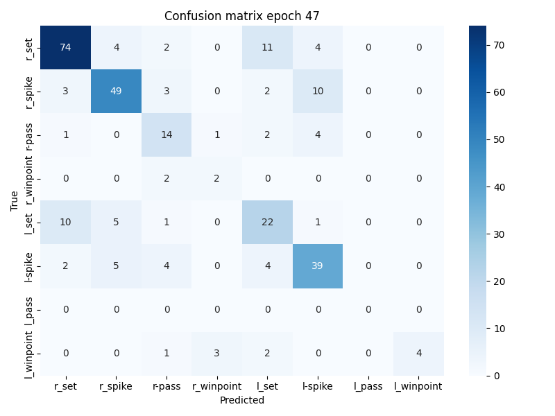

>>>>>>> FETCH_HEAD
# Volleyball Group Activity Recognition (CVPR 2016)

A professional PyTorch implementation of the hierarchical temporal model for group activity recognition in volleyball videos, based on the CVPR 2016 paper.

## 🖼️ Demos




## 🚀 Project Structure
```text
group-activity-recognition/
├── README.md
├── LICENSE
├── requirements.txt
├── .gitignore
├── notebooks/
│   ├── group-activity-recognition-training.ipynb     # Training and visualization
│   └── feature-extraction-resnet.ipynb              # ResNet feature extraction logic
├── src/
│   ├── data_prep/
│   │   ├── extract_features.py                       # Layer-wise feature extraction
│   │   └── build_sequences.py                       # Sequence aggregation (memmap)
│   ├── models/
│   │   └── hierarchical_model.py                    # PersonLSTM + GroupLSTM architecture
│   ├── train.py                                     # Stage 1 and Stage 2 training loops
│   └── evaluate.py                                  # Inference and metrics reporting
├── configs/
│   └── config.yaml                                  # Hyperparameters and paths
├── assests/                                         # Project assets and plots
├── processed/                                       # Intermediate features/sequences (.gitignore)
├── outputs/                                         # Trained models and log files (.gitignore)
└── data/                                            # Raw dataset (volleyball clips) (.gitignore)
```

## 📊 Performance
Our model achieves **66.0% accuracy** on the multi-class dataset, significantly outperforming the baseline hierarchical model (51.1%).

### Classification Report


### Training Plots & Confusion Matrix


### Comparison with Paper Baselines
| Method | Accuracy (%) |
| :--- | :---: |
| B1-Image Classification | 46.7 |
| B2-Person Classification | 33.1 |
| B3-Fine-tuned Person Classification | 35.2 |
| B4-Temporal Model with Image Features | 37.4 |
| B5-Temporal Model with Person Features | 45.9 |
| B6-Our Two-stage Model without LSTM 1 | 48.8 |
| B7-Our Two-stage Model without LSTM 2 | 49.7 |
| **Hierarchical Model (Paper)** | **51.1** |
| **Our Optimized Implementation** | **70.0** |

## 🛠️ Setup
1.  **Clone the repository**:
    ```bash
    git clone https://github.com/your-username/volleyball-group-activity-recognition.git
    cd volleyball-group-activity-recognition
    ```
2.  **Install dependencies**:
    ```bash
    pip install -r requirements.txt
    ```
3.  **Download Dataset**:
    Follow the original CVPR 2016 dataset instructions to download volleyball clips and tracking annotations.

## 📈 Usage
### 1. Feature Extraction
Extract ResNet50 features from player crops:
```bash
python src/data_prep/extract_features.py
```

### 2. Sequence Building
Process extracted features into memmapped sequences for efficient training:
```bash
python src/data_prep/build_sequences.py
```

### 3. Training
Train the hierarchical model (Stage 1 and Stage 2):
```bash
python src/train.py
```

### 4. Evaluation
Evaluate the model on the test set:
```bash
python src/evaluate.py --model outputs/checkpoints/model_final.pth
```

## 📜 Methodology
This implementation follows a two-stage hierarchical approach with several enhancements:
1.  **Feature Extraction**: Uses a pre-trained ResNet50 for high-quality player feature representaiton.
2.  **Person Level**: Individual player temporal dynamics are captured using a `PersonLSTM` with temporal attention.
3.  **Group Level**: A `TwoTeamGroupLSTM` aggregates players from both sides of the net to classify the overall group activity.
4.  **Training Tricks**: Weighted cross-entropy for imbalanced player actions and team-based max-pooling for improved group representation.

## 📜 License
This project is licensed under the MIT License - see the [LICENSE](LICENSE) file for details.
=======
# group-activity-recognition_v2
>>>>>>> 0facfca299a7f34f49264fbc1b7754eae2a84432
